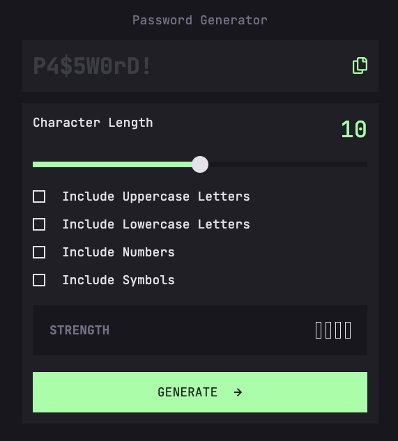

# Frontend Mentor - Password generator app solution

This is a solution to the [Password generator app challenge on Frontend Mentor](https://www.frontendmentor.io/challenges/password-generator-app-Mr8CLycqjh). Frontend Mentor challenges help you improve your coding skills by building realistic projects.

## Table of contents

- [The challenge](#the-challenge)
- [Screenshot](#screenshot)
- [Links](#links)
- [Built with](#built-with)
- [Author](#author)

## The challenge

Users should be able to:

- Generate a password based on the selected inclusion options
- Copy the generated password to the computer's clipboard
- See a strength rating for their generated password
- View the optimal layout for the interface depending on their device's screen size
- See hover and focus states for all interactive elements on the page

## Links

- Live Site URL: https://fascinating-paletas-e06e0b.netlify.app/

## Built with

- [React](https://reactjs.org/)
- Tailwind
- TypeScript
- Vite

## Author

- Website - [Tom Tillistrand](https://www.tomtillistrand.com)
- Frontend Mentor - [@TomTilly](https://www.frontendmentor.io/profile/TomTilly)
- Twitter - [@tomtillistrand](https://twitter.com/tomtillistrand)
